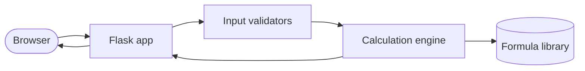

# DoseCalc

> Public showcase repo. Source code lives in a private repo. This page is the technical deep dive.

Medical dosage calculator for healthcare professionals. Reduces the mental math involved in dosing for individual patients and shows the formula behind every result so nothing is a black box.

Runs on `localhost:5003` as a Flask app.

## Why this exists

Bedside dosing math is error prone. Most online calculators give you a number with no formula and no audit trail. DoseCalc shows the math, the units, and the inputs in one view, so the clinician can verify in seconds instead of opening a second tab.

## Architecture



Pure server-side calculation. No database. No PHI is ever stored. Inputs go in, a result and the formula behind it come out.

## Stack
- Python 3, Flask
- HTML, CSS, vanilla JS
- No database (intentional, see below)

## Features
- Dosage calculations by body weight and BSA
- Clear formula display per calculation
- Input validation for ranges and units
- Designed for fast bedside use on phone or tablet

## Walkthrough

A weight-based dosage calculation with the formula displayed alongside the result:


Input validation rejecting an impossible value:


Mobile layout:


_Replace these paths with your own GIFs and screenshots in `demo/` and `screenshots/`._

## Code excerpts

Input validation for a dosage calculation:

```python
def validate_weight_dose_input(payload: dict) -> ValidationResult:
    weight_kg = payload.get("weight_kg")
    if not isinstance(weight_kg, (int, float)) or weight_kg <= 0 or weight_kg > 250:
        return ValidationResult.error("Weight must be between 0 and 250 kg.")

    dose_per_kg = payload.get("dose_per_kg")
    if not isinstance(dose_per_kg, (int, float)) or dose_per_kg <= 0:
        return ValidationResult.error("Dose per kg must be a positive number.")

    return ValidationResult.ok({"weight_kg": weight_kg, "dose_per_kg": dose_per_kg})
```

The formula display, showing math instead of hiding it:

```python
def format_result(weight_kg: float, dose_per_kg: float) -> Result:
    total = weight_kg * dose_per_kg
    return Result(
        total_dose=total,
        formula=f"{weight_kg} kg x {dose_per_kg} mg/kg = {total} mg",
        units="mg",
    )
```

_Replace with your own sanitized excerpts._

## Technical decisions worth calling out

**No database, on purpose.** Storing patient inputs is a regulatory rabbit hole. The tool is stateless. Refresh the page and everything is gone. Less surface area, less liability.

**Formula transparency.** Every calculation shows the formula used, with values substituted in. A clinician can replicate the result on paper and verify.

**Strict input validation.** Negative weights, impossible ages, mismatched units all fail loudly before they reach the calculation engine.

## Safety note
This tool is a calculation aid, not a replacement for clinical judgment. Always verify results against authoritative sources before administering.

## Status
Private source. This showcase exists so the work is inspectable without putting the tool itself in front of users who lack the context to use it safely.
