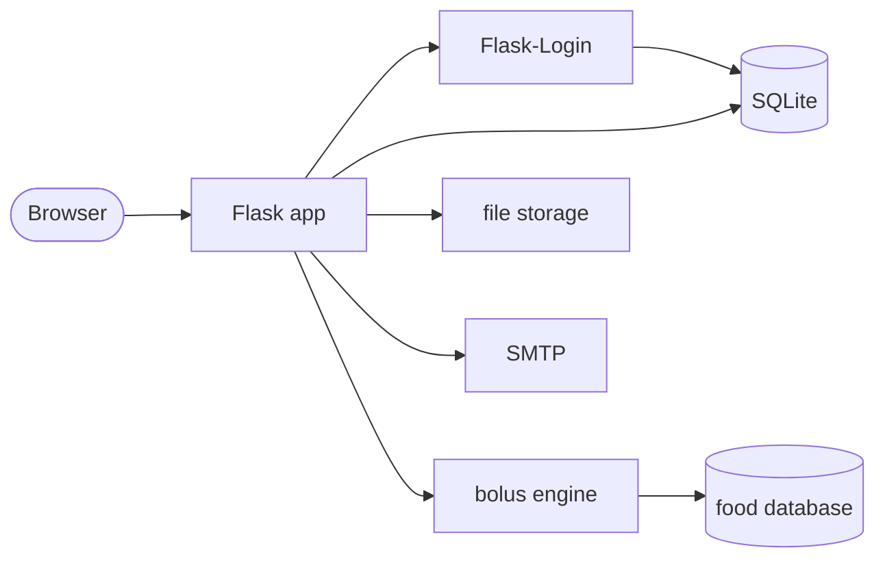
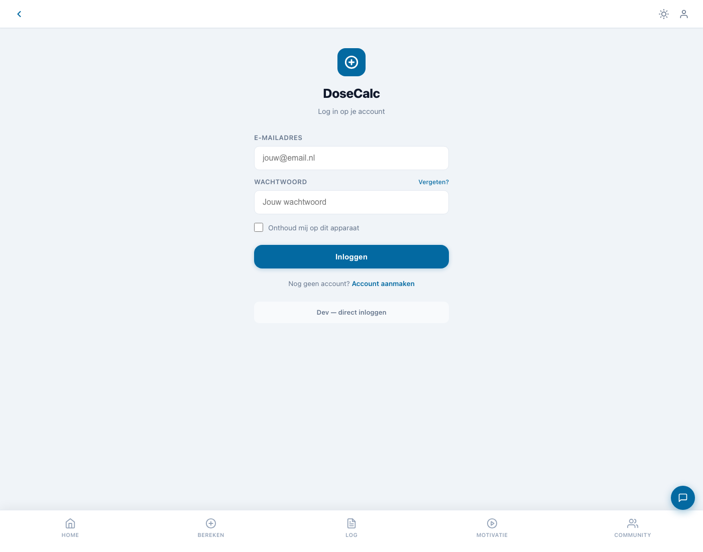
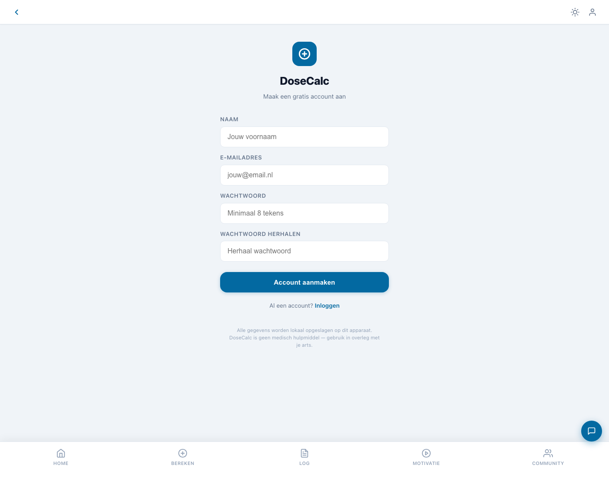
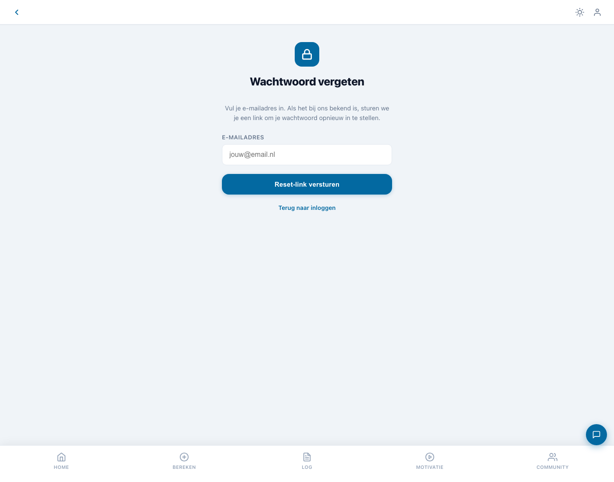

# DoseCalc

> Public showcase repo. Source code lives in a private repo. This page is the technical deep dive.

Insulin bolus calculator app for people living with type 1 diabetes. Calculates meal and correction doses from personal insulin parameters, with an integrated food database, full calculation log, and community features for peer support.

Runs on `localhost:5003` as a Flask app.

## Why this exists

Living with type 1 diabetes means doing insulin math several times a day, every day. Existing tools either oversimplify (one-size-fits-all formulas) or live inside hospital systems patients never see. DoseCalc puts the same math a diabetes educator teaches you onto your phone, with your personal ICR and ISF, a food database for carb counting, and a log so you can see patterns instead of guessing.

## Architecture



Storage is split on purpose. Account data, community posts, and reset tokens live in SQLite (`db.py`). Per-user calculation logs, profile snapshots, and audit data live in flat files (`storage.py`). Calculations themselves are pure functions in `engine.py`.

## Stack
- Python 3
- Flask, Flask-Login
- SQLite (accounts, community, tokens)
- File-based storage (logs, profiles, audit)
- HTML, CSS, vanilla JS

## Features
- Personal bolus calculator: ICR for meals, ISF for corrections, insulin-on-board, target glucose, max bolus cap
- Integrated food database for carb counting per meal
- Full calculation log with after-the-fact confirmation (did you actually take this dose?)
- Onboarding flow that walks through profile setup
- Community feed and motivation features for peer support
- Subscription tiers
- Account management with password reset via email

## Walkthrough

Login screen:



Registration:



Password recovery:



_Showing public, unauthenticated pages only. Calculator, meal builder, dashboard, and log views live behind login and are not captured here to protect user health data._

## Code excerpts

The core bolus calculation, showing the formula every diabetes patient learns:

```python
def bereken_bolus(
    koolhydraten_g: float,
    icr: float,
    glucose_mmol: float,
    target_mmol: float,
    isf: float,
    iob: float = 0.0,
) -> dict:
    """
    icr  = insulin to carb ratio (1 unit per X grams of carbs)
    isf  = insulin sensitivity factor (1 unit lowers glucose by X mmol/L)
    iob  = insulin on board (active insulin still in body)
    """
    meal_bolus = koolhydraten_g / icr
    correction = max(0.0, (glucose_mmol - target_mmol) / isf)
    total = round(meal_bolus + correction - iob, 1)

    return {
        "units": total,
        "formula": (
            f"{koolhydraten_g}g / {icr} + "
            f"max(0, ({glucose_mmol} - {target_mmol}) / {isf}) - "
            f"{iob} IOB = {total} units"
        ),
    }
```

Logged calculation with deferred confirmation, so the user can review later what they actually injected:

```python
def log_berekening(user_id: int, payload: dict, result: dict) -> str:
    entry = {
        "id": str(uuid.uuid4()),
        "user_id": user_id,
        "timestamp": datetime.utcnow().isoformat(),
        "inputs": payload,
        "result": result,
        "confirmed": False,
    }
    _append_to_log(user_id, entry)
    return entry["id"]
```

_Replace with your own sanitized excerpts._

## Technical decisions worth calling out

**Split storage.** Accounts and community content go in SQLite because they need relational queries. Calculation logs are per-user flat files, which makes export, backup, and deletion trivial and keeps user data isolated.

**Formula in every result.** Each calculation shows the math with values substituted in. A user can replicate the result on paper, which is exactly what a diabetes educator teaches.

**Confirmation step.** Calculating a dose is not the same as taking it. Log entries default to unconfirmed and the user confirms after injecting, so the log reflects reality and not intent.

**Profile gating.** No calculations are possible until the user has set their ICR, ISF, and target glucose during onboarding. Better to block than to silently use unsafe defaults.

## Safety note
This tool is a calculation aid, not a replacement for medical advice. Always discuss insulin dosing with your treating physician or diabetes educator.

## Status
Private source. This showcase exists so the work is inspectable without putting the calculator itself in front of users who have not gone through the onboarding flow.
